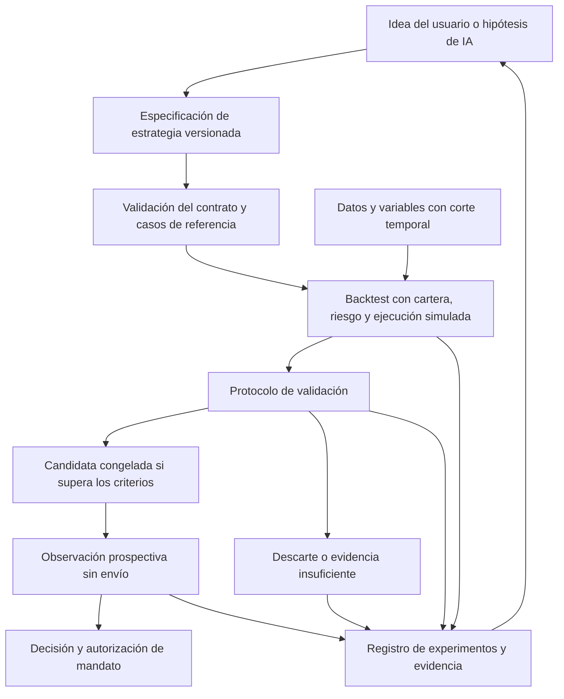
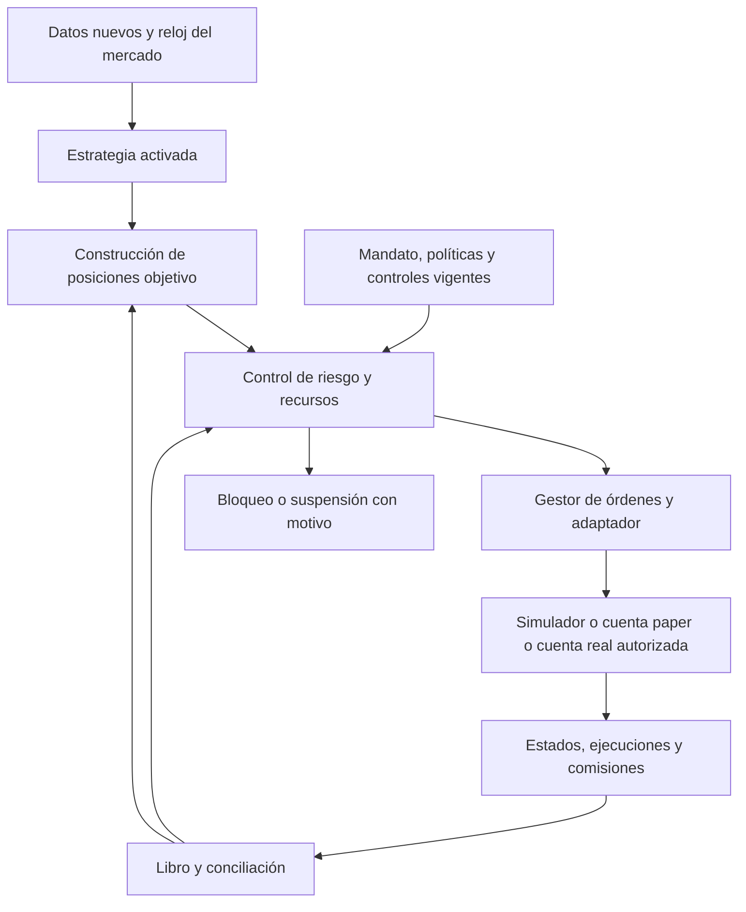

# ATLAS Quant · Arquitectura objetivo y contratos entre módulos

9 de septiembre de 2026. Diseño elaborado por autorización del usuario tras revisar su esquema de plataforma cuantitativa. **Especificación de evolución, sin implementación en esta entrega documental.** Base comprobada: `93c7f7d`, D3 local `0.4.0-dev.2`, esquema SQLite 2. Estado operativo y evidencia histórica en [CONTINUIDAD](CONTINUIDAD.md).

Se mantiene el monolito modular y la secuencia de la [hoja de ruta](hoja_de_ruta.md). Este documento concreta los límites y los recorridos del [diseño completo](atlas_quant_diseno.md); no sustituye los contratos implementados ni reinterpreta resultados anteriores. Para identidad, contabilidad y calidad de v0.4 prevalecen [D1](v0_4_d1.md), [D2](v0_4_d2.md) y [D3](v0_4_d3.md). Los nombres de contratos siguientes son lógicos y futuros: no son nuevos endpoints, clases ni tablas existentes.

## 1. Decisiones de arquitectura

- Separar el desarrollo y aprobación de una estrategia de su ejecución continua. La investigación produce candidatos; una activación autoriza una versión concreta en una cuenta y entorno concretos.
- Compartir el evaluador de estrategia y las reglas de cartera/riesgo entre histórico, simulación local y bróker. El reloj, los datos y el adaptador de ejecución cambian por entorno. Paridad de reglas no implica igualdad de precios o ejecuciones.
- Datos, contabilidad, auditoría y operación sirven a varios módulos. No son escalones que solo se atraviesan una vez.
- El modelo de lenguaje propone hipótesis y explica evidencia. El programa valida sus salidas y limita sus herramientas. La promoción estadística, la autorización de un mandato y el envío son decisiones distintas.
- Riesgo comprueba objetivos antes de operar y monitoriza exposición y estado después. Una deriva de exposición dispara la acción prevista en la política; no implica vender automáticamente.
- Los módulos tienen interfaces explícitas y propiedad de su estado. Store conserva el acceso transaccional a SQLite. Se mantiene un ejecutor por base; el futuro conector añadirá exclusión efectiva por cuenta sin afirmar que ya existe coordinación distribuida.
- No se incorporan por este diseño microservicios, colas distribuidas, un feature store comercial, notebooks integrados, nuevos proveedores ni entrenamiento de modelos. Su necesidad se evalúa por caso y presupuesto.

## 2. Recorrido de investigación

El usuario revisa entrada, salida, tamaño, universo, horarios, datos, costes y comportamiento ante faltantes. La DSL será un contrato declarativo restringido con operadores registrados y versionados; el constructor visual y el agente generan ese mismo contrato. Un texto ambiguo, operador desconocido o parámetro inválido se rechaza antes de simular. Los notebooks, si se añaden, trabajan sobre copias de investigación y no pueden activar mandatos ni acceder a credenciales de bróker.

Antes de buscar parámetros se registra el protocolo: objetivo, benchmark comparable, particiones cronológicas, costes, presupuesto de búsqueda, criterios y período reservado. Walk-forward, sensibilidad, escenarios y remuestreo se aplican cuando sean pertinentes. En Monte Carlo se conservan método y semillas; el remuestreo debe justificar cómo trata la dependencia temporal. Se registran todas las variantes y descartes. Consultar repetidamente el período reservado para modificar la estrategia lo convierte en datos de desarrollo; no conserva su condición de prueba final.

El resultado de validación es `insufficient`, `failed` o `passed`, con motivos y referencias a pruebas. `passed` acredita únicamente los criterios definidos, no rentabilidad futura ni permiso para enviar. La observación prospectiva registra decisiones antes de conocer su resultado y no exige una duración universal: depende de sesiones, señales y condiciones cubiertas. Este diseño no inicia ni sustituye el ensayo operativo de 48 horas aplazado.

La candidata conserva estrategia, código, datos, variables, costes, restricciones y protocolo. Una revisión crea otra candidata. La memoria usada para simular decisiones históricas respeta también el corte temporal; un LLM actual puede contener conocimiento posterior, por lo que su interpretación retrospectiva no acredita capacidad prospectiva. Las pruebas decisivas del agente registran sus propuestas antes de recibir resultados nuevos.

## 3. Recorrido operativo continuo

Los tres destinos son entornos separados, no un selector que autoriza pasar de paper a real. La IA investigadora no participa en cada tick ni recibe permiso de envío. Si posteriormente una estrategia depende de un predictor cuantitativo, la versión del predictor, sus variables y la política ante indisponibilidad forman parte de la estrategia activada; no se cambia el modelo durante una evaluación.

Cada oportunidad tiene un ID estable, un corte de información y una ventana de validez. Una señal produce una intención de exposición, no una compra repetida. El constructor considera posiciones actuales, órdenes pendientes, atribuciones y recursos reservados. Un objetivo ya satisfecho no genera otra orden. Al volver de una pausa no se reproducen todas las oportunidades caducadas: se omiten o se recalcula una oportunidad actual según el mandato.

## 4. Módulos, propiedad y límites

| Módulo lógico | Responsabilidad y estado propio | Dependencias y límites |
|---|---|---|
| Datos e identidad | Instrumentos/cotizaciones, proveedores, calendarios, precios, FX, eventos, calidad y versiones de entrada | No escribe posiciones ni órdenes. Disponibilidad desconocida permanece desconocida. |
| Variables derivadas | Definiciones, versiones, ventanas, calentamiento, valores y procedencia | Lee snapshots; misma transformación histórica/operativa. Solo materializar un almacén específico si aporta utilidad medida. |
| Investigación y memoria | Hipótesis, planes, resultados favorables/desfavorables, contexto recuperado y consumo del agente | Solo solicita trabajos permitidos y acotados. No escribe mandatos, riesgo ni libro. OpenAI/Anthropic y futuro modelo local intercambiables. |
| Registro de estrategias y evaluador | Especificación, versión, operadores e indicador/estado de cada instancia de estrategia | Función sobre observaciones, reloj y estado explícitos; sin HTTP ni bróker. Un estado por instancia, con checkpoint persistido por el caso de uso. |
| Construcción de cartera | Objetivos por instrumento, asignación entre reglas y criterio ante objetivos incompatibles | Consume señales y cuenta reconciliada. No presume que una venta pendiente libera efectivo. Riesgo puede rechazar o ajustar según política explícita. |
| Backtest | Reloj simulado, modelo de costes/fills, ejecuciones simuladas y artefactos de cada run | Reutiliza estrategia, cartera y riesgo; tiene su propio estado aislado. OHLC no acredita una trayectoria ni prioridad de ejecución intradía. |
| Validación | Protocolos, particiones, escenarios, comparaciones y decisiones de evidencia | Puede invocar backtests. No altera el período reservado ni activa estrategias; registra incertidumbre y límites. |
| Registro de activaciones | Candidatas, mandatos, autorizaciones, vigencias y estado de activación por cuenta | Vincula versiones exactas; un resultado estadístico no es una autorización. No modifica parámetros de una estrategia activa. |
| Riesgo | Políticas, decisiones y bloqueos por cuenta/regla; cálculo de exposición y recursos | Usa libro, cotizaciones y obligaciones pendientes del OMS. Revalida al enviar; no puede quedar limitado al proceso investigador. |
| OMS y adaptadores | Intenciones, reservas pendientes, IDs del bróker, órdenes, estados de envío y eventos remotos normalizados | Único emisor de la cuenta; persistencia mediante Store. El adaptador traduce protocolos y capacidades, no decide la estrategia. |
| Libro y conciliación | Movimientos económicos, posiciones/saldos derivados, diferencias y resolución | Las ejecuciones confirmadas y movimientos contrastados alimentan el libro. Un aviso de orden enviada no es un fill. Correcciones enlazadas, originales conservados. |
| Operación y auditoría | Trabajos, eventos correlacionados, bloqueos, copias, salud, alertas y recuperación | Apoya todos los módulos. La interfaz muestra estado; cerrar la pestaña no cancela una ejecución. No introduce un segundo propietario del estado financiero. |

Las reservas operativas pertenecen al OMS; riesgo calcula su admisibilidad y el caso de uso confirma decisión, reserva e intención en una transacción. El libro registra el efectivo económico; el saldo disponible para decidir incorpora esas reservas una sola vez. La atribución virtual entre estrategias no duplica las posiciones reales de la cuenta. Las operaciones manuales externas entran por conciliación antes de reconsiderar objetivos.

## 5. Contratos lógicos

Todos los contratos persistidos llevan versión de esquema e identificadores estables. La correlación conecta proyecto/experimento, estrategia, activación, cuenta, oportunidad, intención, orden y ejecución. Se conservan referencias de versiones, políticas y hashes pertinentes; las lecturas incluyen calidad y motivos de bloqueo. Importes y cantidades económicos usan las convenciones decimales de D1; no migrar respuestas heredadas silenciosamente. Timestamps UTC con zona, fecha de sesión y calendario explícitos.

| Contrato | Contenido mínimo | Invariante |
|---|---|---|
| `DataSnapshot` / `ObservationBatch` | Identidad, fuente, versión, barras/datos, moneda, calendario, tiempo efectivo, disponibilidad, recepción, calidad y corte | Nada posterior al corte entra en la decisión. La recepción no prueba disponibilidad histórica. Snapshot inmutable; una corrección crea versión. |
| `FeatureSet` | Definición/versión de cada variable, parámetros, inputs, ventana, calentamiento y fecha de disponibilidad derivada | No disponible antes de sus inputs y de su cálculo efectivo. Transformaciones aprendidas se ajustan solo con entrenamiento. |
| `StrategySpec` | ID/versión, universo de señales y de negociación, operadores, reglas de entrada/salida, estado/rearme, datos, horarios, política de faltantes | Solo operadores admitidos; misma evaluación sobre mismos inputs y estado. El mandato restringe dónde puede ejecutarse. |
| `ExperimentSpec` / `RunResult` | Versiones de estrategia/código/datos/variables, costes, reglas de riesgo, partición, semilla, entorno, métricas y operaciones | Reproducción con tolerancias declaradas; fallo o descarte permanece consultable. Los fills simulados se identifican como tales. |
| `ValidationDecision` | Protocolo/versiones, runs, resultado, criterios, motivos y limitaciones | No cambia criterios tras observar el test; no autoriza enviar. Cambiar evidencia no reescribe decisiones históricas. |
| `ActivationMandate` | Candidata, cuenta y entorno, instrumentos permitidos, capital/monedas, límites, vigencia, autorizante y política de fallos | Activación expresa y versionada; cambio de cuenta, entorno, regla o límites materiales requiere otra activación. |
| `Signal` | ID, estrategia/instancia, oportunidad, instrumento/contexto, dirección/condición, corte, datos usados y caducidad | No lleva autoridad de envío. Una oportunidad repetida conserva identidad y no multiplica efectos. |
| `PositionTarget` | Cuenta, instrumento, cantidad o peso objetivo con unidad explícita, señales/mandatos contribuyentes, fecha y snapshot de estado | Objetivo absoluto, no orden incremental. Resolver conflictos entre reglas antes del envío; guardar la conversión peso→cantidad. |
| `RiskDecision` | Objetivo, revisiones de cuenta/mandato/política, marca de mercado, límites, reservas consideradas, aprobado/rechazado y motivos | Una aprobación caducada o calculada sobre estado cambiado no se reutiliza; rechazos sin efectos de envío. |
| `OrderIntent` | Clave de idempotencia, cuenta/entorno, oportunidad y contribuyentes, contrato, lado, cantidad, límite, vigencia, reserva y decisión | Misma clave con otro contenido es conflicto. Confirmar intención, reserva y auditoría juntos; validación final inmediatamente antes de transmitir. |
| `BrokerEvent` / `Fill` | Bróker/cuenta, IDs de orden/ejecución, tipo, tiempos de recepción y de origen, cantidades, precios, moneda y comisiones | Deduplicar según identidad del proveedor; una corrección/reversión es un evento vinculado. Comisión tardía no crea otra ejecución. |
| `LedgerEvent` / `ReconciliationResult` | Origen/fill o movimiento, importes exactos, vínculos de corrección, saldos/posiciones al corte, diferencias y resolución | Libro y auditoría se confirman juntos; diferencias críticas bloquean el ámbito definido. Conservar qué confirmó el bróker y qué calculó ATLAS. |

Los contratos HTTP concretos se decidirán por entrega y generarán sus tipos con `tools/export_contracts.py`. Este documento no cambia las rutas actuales `/api/...` ni impone inmediatamente la propuesta histórica `/api/v1` del diseño completo.

## 6. Transacciones y efectos externos

1. Leer un contexto coherente con revisiones de cuenta, cartera, datos, política y activación. Calcular fuera de la transacción cuando sea costoso.
2. Releer dentro de la transacción y rechazar resultados obsoletos. Confirmar intención, reservas y auditoría de forma atómica; no persistir un snapshot antiguo tras un `await`.
3. El emisor exclusivo revalida vigencia, cuenta/entorno, controles y estado; deja persistido `sending` antes del efecto externo. Solo transmite si conserva su autorización. La parada se comprueba en ese límite; una transmisión ya iniciada puede requerir cancelación y conciliación.
4. Una transacción local no cubre la red ni permite prometer envío exactamente una vez. Tras timeout o reinicio con `sending`, tratar como incierto y consultar órdenes/ejecuciones. No reenviar automáticamente. Si no se resuelve, bloquear la cuenta o el ámbito afectado para revisión.
5. Los eventos de bróker actualizan orden, ejecuciones, reservas, libro y auditoría mediante casos de uso transaccionales. No sumar fills a partir de cada callback de estado. Liberar reservas según confirmación y política conservadora, no al solicitar cancelación.

El simulador cumple el mismo contrato económico, aunque produzca eventos sintéticos. En paper externo y real se guarda el deslizamiento observado respecto a una referencia fechada; el modelo de costes del backtest sigue siendo una estimación identificada. Una recalibración crea otra versión y no modifica pruebas anteriores.

## 7. Promoción, suspensión y recuperación

| Transición | Condición y acción |
|---|---|
| Borrador → evaluable | DSL válida, reglas completas, capacidades de datos suficientes y casos de referencia. |
| Evaluable → candidata | Protocolo completado y resultado registrado. Rechazo o evidencia insuficiente conservan el historial y bloquean promoción ordinaria. |
| Candidata → paper activo | Versión congelada, observación exigida por protocolo, mandato paper autorizado, cuenta/entorno verificados y estado conciliado. Los ensayos técnicos del conector usan fixtures y una autorización de prueba separada; no acreditan una estrategia. |
| Activo → suspendido | Incidencia de datos, riesgo, sesión, reserva, conciliación, mandato caducado o petición del usuario, según severidad y alcance de política. Guardar razón y qué operaciones siguen permitidas. |
| Suspendido → activo | Causa resuelta con evidencia, sincronización completada y condiciones de reanudación del mandato satisfechas. La reanudación automática solo se admite para incidencias transitorias definidas expresamente; ambigüedad financiera requiere revisión. |
| Activo → retirado | Deja de originar oportunidades; órdenes y posiciones existentes siguen gestionadas conforme al mandato. Retirar no implica liquidar. |
| Paper → real | Crear otra activación y cuenta/entorno segregados tras validación y autorización explícitas. Nunca cambiar el destino de órdenes existentes ni reutilizar aprobación paper. |

Tres controles distintos: **pausar nuevas intenciones**, **solicitar cancelación de órdenes abiertas** y **reducir/liquidar posiciones**. Cada uno define cuenta, estrategias, tratamiento de órdenes manuales, permisos, registros y excepciones. Una liquidación es una nueva operación sujeta a la política prevista; no el efecto implícito de un kill switch. Mantener lectura y conciliación durante la suspensión siempre que la conexión lo permita.

Al reiniciar: adquirir exclusión → recuperar estado persistido → verificar cuenta y entorno → consultar posiciones, efectivo, órdenes y ejecuciones → resolver pendientes/inciertos → contrastar mandatos y datos → habilitar únicamente lo autorizado. No reanudar envíos antes de conciliar ni ejecutar en lote señales vencidas. Una restauración antigua exige contrastar con el bróker los efectos ocurridos después de la copia.

## 8. Escenarios de aceptación entre módulos

| Escenario | Resultado que debe demostrarse al implementar |
|---|---|
| Misma estrategia e inputs en replay y flujo operativo simulado | Mismas señales y objetivos; diferencias de fills solo por modelo/entorno declarado. |
| Dato corregido, futuro o sin disponibilidad suficiente | Resultado antiguo reproducible; nueva decisión bloqueada o marcada según capacidad, sin inventar datos. |
| IA genera operador no admitido o solicita cambiar límites | Rechazo de la propuesta; sin cambios de mandato, reservas, órdenes o credenciales. |
| Dos estrategias intentan gastar el mismo efectivo | Decisión agregada y reservas transaccionales; no sobregiro ni doble asignación. |
| Llega un fill entre cálculo y confirmación de objetivo | Revisión detectada; recalcular en lugar de publicar una orden sobre estado antiguo. |
| Señal, callback o solicitud repetidos | No duplica intención, fill ni asiento. Correcciones y comisiones tardías conservan sus vínculos propios. |
| Caída antes/después de envío, confirmación perdida o segunda instancia | Recuperar y consultar antes de otro envío; un único emisor; incertidumbre visible y ámbito bloqueado. |
| Ejecución parcial mientras se cancela | Registrar la ejecución real y esperar resolución del remanente; ninguna liberación prematura de recursos. |
| Pausa, caducidad, pérdida de sesión o datos obsoletos | Detener el ámbito previsto, conservar posiciones y mantener conciliación; no crear órdenes retrospectivas al volver. |
| Operación manual, cuenta equivocada o restauración antigua | Discrepancia detectada antes de enviar; identidad del entorno comprobada por información de cuenta, no solo por puerto. |
| Candidata nueva o modelo actualizado | Activación vigente intacta hasta completar evaluación y autorización de la nueva versión. |

Estas son pruebas futuras de aceptación; no se presentan como ejecutadas hoy. CI ordinaria utiliza datos aislados y emulador, sin credenciales ni destino real. Las pruebas con bróker paper requieren cuenta/acceso y alcance autorizados; nunca se infieren del resultado de la CI.

## 9. Encaje incremental en versiones

| Versión | Trabajo arquitectónico | Límite de la entrega |
|---|---|---|
| v0.4 | Completar identidad, calidad, libro, conciliación CSV, eventos y FX según D1–D8 | D1 especificado, D2 publicado, D3 local. Sin nuevos bloques ni reescritura por este documento. |
| v0.5 | Posiciones objetivo, agregación de reglas/recursos y evaluación de riesgo reutilizable junto al análisis previsto | Propuestas de cartera; no envíos ni conector de bróker. |
| v0.6 | DSL inicial restringida, evaluador compartido, backtest/validación separados, registro de candidatas y memoria | Priorizar recorrido reproducible sobre catálogo creciente de indicadores; McClellan y LaTeX mantienen sus condiciones. |
| v0.7 | Lectura/conciliación → paper supervisado → paper automático acotado → fallos/recuperación | OMS, mandatos paper y reservas explícitos. Cuenta real no habilitada. Detalle en hoja de ruta. |
| v0.8 / v0.9 | Control remoto personal y panel móvil opcionales sobre los mismos casos de uso | Un único servidor/emisor; clientes remotos no crean otro motor ni otra base autoritativa. |
| v1.0 | Consolidación y operación sostenida del recorrido completo incluido | No se declara estable para evitar ensayos pendientes; cierre operativo según evidencia. |
| v1.1 | Predictor cuantitativo opcional con variables/modelos versionados y evaluación temporal | Independiente del LLM; una regla fija puede seguir siendo la alternativa elegida. |
| v1.2 / v1.3 | Operativa real supervisada y después automática con mandatos explícitos | Reutilizar límites/OMS probados, ampliar permisos solo tras autorización y validación real delimitada. |

La numeración y el orden se conservan. El aumento principal de definición está en v0.5–v0.7: concreta trabajo necesario y puede requerir varias entregas de desarrollo dentro de cada versión; no es una estimación de esfuerzo ni una fecha comprometida. El paper automático acotado queda explícito en v0.7; v1.3 se refiere a automatización **real**. Móvil, remoto, modelos locales y aprendizaje no son requisitos técnicos para ejecutar una estrategia fija en paper.

## 10. Qué existe y qué falta

| Punto de partida comprobado | Evolución pendiente |
|---|---|
| `catalog.py`, `datasets.py`, `prices.py`, `quality.py` / `quality_service.py` y versiones SQLite | Completar D4–D8; variables derivadas versionadas cuando se necesiten. Calidad documentada por el usuario no certifica una fuente. |
| `analytics.py`, `portfolios.py` e `identity_store.py`: libro/cartera EUR y vínculos a precios | Semántica multidivisa y conciliación prevista; cuenta de bróker y atribución entre estrategias posteriores. |
| `backtest.py`, `paper.py`: reglas acotadas y simulación interna | Evaluador/objetivos compartidos más generales. El paper actual no es el conector externo ni reproduce parciales reales. |
| `gates.py`, `controls.py`, `service.py`: filtros, controles y transacciones | Riesgo continuo de cuenta, registro de mandatos y ciclo de órdenes externas; no afirmar cobertura actual de toda la tabla de aceptación. |
| `ai.py`: adaptadores OpenAI/Anthropic para catálogo limitado y resúmenes | Memoria ampliada, builder/DSL, herramientas acotadas de investigación; modelo local opcional sin selección ni instalación ahora. |
| `store.py`, bloqueos, copias y lanzador | Conservar invariantes actuales y extenderlos al bróker; no repartir escrituras entre PCs con SQLite compartido. |

Decisiones futuras al acotar cada versión: primeras familias/operadores de DSL, agregación de señales incompatibles, límites y umbrales de promoción, fuente histórica/prospectiva, capacidades exactas de cuenta IBKR y política de órdenes. No se fijan valores de inversión ni presupuestos del usuario en este documento. Se mantiene presupuesto API cero; la importación personal y el ensayo de 48 horas siguen aplazados. No se han ejecutado backtests, llamadas de IA, instalación ni operativa por redactarlo.

Referencias de diseño: [separación de señales, cartera, riesgo y ejecución en LEAN](https://www.quantconnect.com/docs/v2/writing-algorithms/algorithm-framework/overview), [ejecuciones e identificadores de IBKR](https://www.interactivebrokers.com/docs/tws-api/doc/order-management/execution-details/the-execution-object). Sirven de contraste técnico; no implican incorporar LEAN ni validar ya un adaptador IBKR. La selección definitiva de SDK y las condiciones del proveedor se comprobarán al desarrollar el conector.
