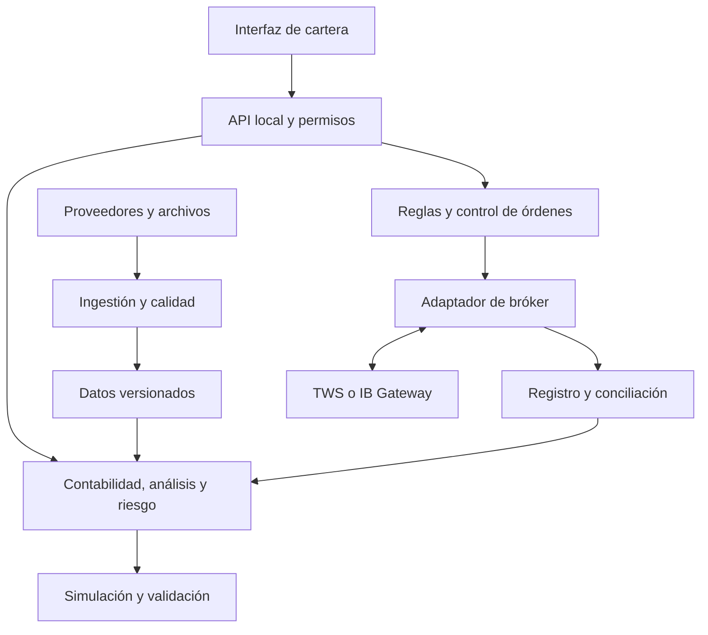

# ATLAS Quant

## Diseño funcional y técnico de una plataforma de cartera personal

Versión 1.0 · 5 de septiembre de 2026

Acciones y ETF · Análisis, simulación y órdenes reales · Automatización configurable

**Estado de la entrega:** especificación para implementar y validar. Los controles, pruebas y objetivos de rendimiento descritos son requisitos del producto; todavía no se han construido ni superado. ATLAS Quant es un nombre de trabajo.

## 1. Decisión de producto

Diseñaría una aplicación personal que reúna posiciones, efectivo, rentabilidades, riesgo, análisis de acciones y ETF, planificación de aportaciones y rebalanceo. Su principal utilidad será poder responder: cuánto tengo, cómo se explica el resultado, qué riesgos estoy acumulando y qué operaciones cumplen mi política de inversión.

El producto incluirá conexión a un bróker y automatización por reglas. Una regla podrá generar propuestas o enviar órdenes dentro de un mandato previamente configurado. La evolución será análisis, simulación, operativa supervisada y automatización acotada, con requisitos de aceptación en cada transición.

**Decisiones confirmadas por el usuario:** cartera personal; acciones y ETF como primer mercado; diseño completo con fases de implementación; posibilidad de operar con dinero real y automatizar bajo límites; empezar con recursos gratuitos; comparar brókeres, considerando Interactive Brokers.

**Supuestos de diseño revisables:** un usuario, equipo Windows, interfaz en español, EUR como moneda de informe, instrumentos de Europa y Estados Unidos y decisiones principalmente diarias, semanales o mensuales. España se toma como contexto inicial para contrastar disponibilidad de productos, sin dar por confirmada la residencia fiscal. No se presupone que la cuenta de IBKR ya esté abierta o configurada.

Recomiendo empezar con acciones ordinarias y ETF convencionales, posiciones compradas y sin financiación por margen. El catálogo identificará productos apalancados, inversos o complejos para impedir que entren accidentalmente en las reglas iniciales. Posiciones importadas que no cumplan ese alcance se mostrarán y explicarán, aunque su operativa automática quede deshabilitada.

La completitud consistirá en cerrar el ciclo de una decisión de inversión con datos, contabilidad y controles verificables. Añadir cien indicadores o un predictor de precios antes de cerrar ese ciclo aportaría poco.

**Cuándo compensa construirlo.** Si la necesidad real acaba siendo registrar unos pocos ETF y hacer compras periódicas, desarrollar toda esta plataforma no compensaría por ahorro económico. Primero contrastaría herramientas existentes: [Portfolio Performance](https://www.portfolio-performance.info/en/) ya cubre historial, rentabilidad, divisas y asignación; [IBKR ofrece inversiones recurrentes](https://www.interactivebrokers.com/en/trading/recurring-investments.php) sobre instrumentos elegibles. El desarrollo propio se justifica por flujos, investigación o controles que esas opciones no resuelvan, o por su valor formativo. La fase 0 deberá documentar qué carencia concreta se está cubriendo.

## 2. Qué incluye y qué queda para después

| Capacidad | Producto previsto | Tratamiento inicial |
|---|---|---|
| Cartera y efectivo | Posiciones, movimientos, dividendos, comisiones y divisas | Núcleo obligatorio |
| Acciones y ETF | Fichas, comparaciones, filtros y documentación | Según cobertura verificable del dato |
| Rendimiento | TWR, rentabilidad personal, contribuciones y benchmarks | Obligatorio, con convenciones visibles |
| Riesgo | Concentración, correlación, drawdown y escenarios | Obligatorio; estimaciones con límites |
| Rebalanceo | Objetivos, bandas y prioridad a nuevas aportaciones | Primera automatización útil |
| Backtesting | Reglas de cartera con costes y evaluación temporal | Incluido antes de automatizar |
| Órdenes reales | Compra, venta, cancelación y conciliación | Conector inicial IBKR, sujeto a prueba |
| Automatización | Calendario o bandas, límites y registro | Incluida tras validar la operativa |
| Optimización | Restricciones y sensibilidad de carteras | Posterior a pesos objetivo y reglas sencillas |
| Valoración empresarial | Ratios y escenarios de valoración | Opcional si existen datos comparables |
| IA | Explicar resultados y buscar en documentos | Opcional; sin autoridad para operar |
| HFT, opciones, futuros, cortos y cripto | Requieren otros modelos y datos | Fuera de la primera especificación operativa |
| Servicio para terceros y fiscalidad automática | Cambian obligaciones y arquitectura | Proyecto posterior independiente |

No se fijan objetivos de rentabilidad ni una asignación concreta de inversión. El sistema implementará la política que el usuario defina y permitirá evaluar sus consecuencias.

## 3. Experiencia de usuario y pantallas

La navegación tendrá ocho áreas. La información crítica de cuenta, modo de operativa, conexión y antigüedad del dato permanecerá visible. Se distinguirá el último cierre de una cotización en directo. El color se acompañará de texto e iconos para que un estado no dependa de distinguir rojo y verde.

| Área | Pregunta que resuelve | Contenido y acciones |
|---|---|---|
| Resumen | ¿Qué ha cambiado y qué requiere atención? | Patrimonio, flujos, resultado económico, TWR, riesgo principal, tareas y alertas |
| Cartera | ¿Qué tengo realmente? | Posiciones y efectivo por divisa, lotes económicos, movimientos, costes y conciliación |
| Explorar | ¿Qué instrumento estoy analizando? | Búsqueda por ISIN, nombre o ticker; fichas, comparador y listas de seguimiento |
| Riesgo | ¿Dónde se concentra mi exposición? | Emisor, sector, país, divisa económica, solapamientos de ETF y escenarios |
| Planificar | ¿Qué cambia si aporto o rebalanceo? | Pesos objetivo, presupuesto, restricciones, coste estimado y resultado antes/después |
| Laboratorio | ¿La regla funciona bajo supuestos razonables? | Backtests, benchmarks, sensibilidad y resultados fuera de muestra |
| Operativa | ¿Qué órdenes existen y en qué estado están? | Propuestas, órdenes del bróker, ejecuciones parciales, cancelaciones y automatizaciones |
| Datos y sistema | ¿Puedo confiar en este resultado? | Cobertura, incidencias, permisos, fuentes, copias, versiones y registro de decisiones |

Cada cifra abrirá un detalle con fórmula, entradas, fecha de valoración, divisa, fuente y limitaciones. Por ejemplo, el beneficio de una posición separará precio, cambio de divisa, distribuciones y costes. Los gráficos permitirán alternar patrimonio y rentabilidad: una aportación eleva el primero sin constituir una ganancia.

Las tablas tendrán búsqueda, ordenación, filtros y exportación CSV. Los informes podrán descargarse como PDF y como paquete de datos reproducible. La interfaz será utilizable con teclado y a partir de una ventana de 1.280 píxeles; en pantallas pequeñas priorizará consulta y revisión, sin comprimir la confirmación de órdenes.

### 3.1 Primer uso

1. Elegir moneda de informe, zona horaria y modo de análisis.
2. Importar un extracto o conectar el bróker con operativa deshabilitada.
3. Resolver instrumentos ambiguos: ISIN, clase, mercado, moneda y contrato del bróker.
4. Revisar una previsualización de movimientos y duplicados antes de importarlos.
5. Conciliar efectivo y cantidades. Si faltan compras antiguas, permitir un saldo inicial identificado y limitar el historial de rentabilidad y costes de adquisición.
6. Elegir benchmark y política de inversión. Las automatizaciones seguirán desactivadas hasta configurarlas.

El asistente de conexión a IBKR deberá permitir probar cuenta, posiciones, datos y permisos por separado. Familiarizarse con TWS incluirá verificar una posición, una orden limitada, una cancelación y la diferencia entre cuenta simulada y real; no exige dominar toda la plataforma.

### 3.2 Ejemplo de flujo completo

**Ejemplo ficticio, sin recomendación de inversión:** una cartera de 10.000 EUR tiene objetivos elegidos por el usuario y recibe una aportación de 500 EUR. El sistema confirma que el dinero existe y está disponible, calcula las desviaciones y propone asignar la aportación a las posiciones infraponderadas. Antes de vender, compara el ajuste obtenido, los costes y las posibles consecuencias fiscales.

La pantalla muestra cantidades negociables, coste estimado, efectivo remanente y pesos posteriores. Si el usuario tiene una regla automática activa que cubre exactamente ese caso, el motor podrá ejecutar dentro de sus límites. Si faltan precios adecuados, permisos o efectivo, registrará por qué no ha operado. No registrará una aportación hasta que exista un ingreso observado o un movimiento manual identificado.

## 4. Bróker: elección y límites de la comparación

**Elegiría IBKR como primer conector.** La razón es el ajuste entre cuenta multimoneda, cobertura de mercados y herramientas de integración disponibles. La elección es técnica; las condiciones finales dependen de la entidad, la cuenta y los mercados del usuario.

| Candidato | Encaje | Inconveniente relevante | Decisión de diseño |
|---|---|---|---|
| Interactive Brokers | TWS API compatible con Python y conexión mediante TWS o IB Gateway; API y servicios de informes | Configuración, sesiones, permisos y datos de mercado requieren atención | Primer conector; demostrarlo con cuenta simulada antes de prometer funciones |
| Trading 212 Invest | API pública con entornos demo y real | API en beta; documentación de órdenes limita la moneda; verificar idempotencia por endpoint | Segundo candidato si sus restricciones encajan; adaptador de capacidades explícitas |
| Saxo OpenAPI | API documentada con simulación y solicitud de acceso de aplicación a producción | Condiciones de cuenta, acceso y posibles costes de custodia dependen del caso | Alternativa a contrastar si existe una razón concreta para usar Saxo |

Fuentes: [IBKR API](https://www.interactivebrokers.com/docs), [Trading 212: órdenes](https://docs.trading212.com/api/orders) y [Saxo: desarrollo y acceso live](https://www.developer.saxo/openapi/learn). La disponibilidad contractual para el usuario en España deberá comprobarse durante el alta; la existencia de una API no la garantiza.

Para IBKR se propone TWS API mediante el SDK oficial, encapsulado en un adaptador. TWS facilita contrastar visualmente las primeras pruebas; IB Gateway permite una conexión con menor carga de interfaz. Su instalación forma parte de esta vía de integración. La Web API se reevaluaría si su autenticación y condiciones encajan mejor con el despliegue elegido. [IBKR: TWS o IB Gateway](https://www.interactivebrokers.com/docs/tws-api/doc/download-tws-or-ib-gateway/download-tws-or-ib-gateway).

El conector debe descubrir capacidades por cuenta e instrumento: órdenes, fracciones, precios mínimos, permisos, sesiones y datos. No se deducirá que una función de la aplicación oficial esté disponible igual por API. La automatización dependerá de mantener una sesión válida y atender las solicitudes de autenticación; no se diseñará un mecanismo para eludirlas.

El catálogo conservará documentación y elegibilidad de ETF. Que un producto cotice en Estados Unidos o tenga datos disponibles no demuestra que la cuenta pueda comprarlo. La interfaz mostrará el motivo devuelto por el bróker y el acceso al KID cuando corresponda. [IBKR: documentación PRIIPs KID](https://www.ibkrguides.com/orgportal/pripskid.htm).

## 5. Datos: una fuente adecuada para cada trabajo

Se separan cuatro necesidades: **estado real de la cuenta**, **histórico para investigar**, **información de instrumentos** y **cotización para decidir una orden**. Ningún proveedor se presumirá suficiente para las cuatro.

### 5.1 Jerarquía de fuentes

- Estado de cuenta: extractos, ejecuciones y posiciones del bróker. El registro local reconstruye y explica; las discrepancias se investigan, no se ocultan sobreescribiendo saldos.
- Histórico diario: archivos importados y proveedor autorizado. Los precios observados, ajustados y de retorno total se guardan con semántica distinta.
- ETF: emisor y documentos oficiales para ISIN, clase, acumulación/distribución, índice, gastos, réplica, cobertura de divisa y holdings fechados.
- Acciones: cuentas publicadas y proveedor de fundamentales con fecha de publicación, moneda y periodo fiscal. Ratios calculados a partir de esas entradas, con definición uniforme.
- Cambio para informes: fuente documentada como BCE, usando la fecha y convención seleccionadas. Un cambio de referencia diario no es un precio ejecutable. [BCE: tipos de referencia](https://www.ecb.europa.eu/stats/policy_and_exchange_rates/euro_reference_exchange_rates/html/index.en.html).
- Órdenes: cotización adecuada al contrato y mercado, obtenida mediante acceso autorizado y con estado de sesión y frescura comprobados.

### 5.2 Plan gratuito y ampliaciones

| Fuente | Coste publicado o de uso previsto | Utilidad y limitación |
|---|---|---|
| Extractos propios, documentos de emisores y BCE | Sin suscripción adicional en el uso previsto | Base de cartera, documentación y conversión; requieren normalización y no cubren toda la investigación |
| yfinance | Biblioteca gratuita | Exploración personal bajo condiciones de las fuentes; no fuente operativa exclusiva ni garantía de continuidad |
| Alpha Vantage gratuito | Hasta 25 peticiones/día | Complemento para pocos instrumentos; el endpoint diario ajustado es Premium |
| EODHD gratuito | 20 peticiones/día y un año de histórico según plan | Prueba de integración; escaso para validar ciclos largos |
| EODHD EOD All World | USD 19,99/mes | Ampliación de históricos diarios; confirmar bolsa, instrumento, ajustes y derechos antes de pagar |
| Datos del bróker | Según mercado y permisos | Prioridad cuando hagan falta cotizaciones para operar; contratar solo la cobertura necesaria |

Fuentes: [yfinance](https://ranaroussi.github.io/yfinance/), [Alpha Vantage: soporte](https://www.alphavantage.co/support/), [Alpha Vantage: diario ajustado](https://www.alphavantage.co/documentation/#dailyadj), [EODHD: planes](https://eodhd.com/pricing). Precios consultados el 5 de septiembre de 2026; impuestos, moneda de facturación y condiciones pueden alterar el importe final.

Los datos gratuitos permiten una herramienta útil para una cartera conocida. No demuestran cobertura histórica de empresas desaparecidas, composiciones antiguas de índices, fundamentales tal como se publicaron o revisiones. Si esa información falta, se limitarán las conclusiones de los backtests correspondientes. Comprar una suscripción diaria tampoco acredita automáticamente todos esos requisitos.

### 5.3 Contrato de datos y calidad

Todo registro normalizado tendrá instrumento estable, mercado, proveedor, tipo de dato, moneda/unidad, tiempo del hecho, publicación cuando exista, disponibilidad conocida, ingestión, versión y origen. Si una fecha es desconocida o aproximada, se marcará; el sistema no inventará precisión temporal.

El control de calidad comprobará duplicados, tipos, calendarios, zonas horarias, valores ausentes, volumen imposible, incoherencia OHLC, moneda y cambios extraordinarios. Un salto grande activará una revisión de eventos corporativos; no se borrará automáticamente por parecer un error. Un dato inválido se pondrá en cuarentena conservando el original.

Las consultas históricas usarán la información disponible en la fecha simulada, también para cambios de universo, indicadores y revisiones de fundamentales. Un precio ajustado retrospectivamente no servirá sin evaluación para una señal que depende del nivel nominal. [FRED/ALFRED: información y revisiones históricas](https://fred.stlouisfed.org/docs/api/fred/realtime_period.html).

El catálogo de conjuntos mostrará cobertura temporal y de instrumentos, porcentaje de ausencias, incidencias abiertas y usos admitidos. Una interrupción de proveedor conservará la última versión íntegra y su fecha. Cambiar de proveedor exigirá verificar convenciones; no se rellenará una serie con otra silenciosamente.

## 6. Contabilidad y corrección financiera

El núcleo será un registro de eventos económicos con entradas equilibradas por moneda y movimientos de inventario conciliables. Las correcciones se harán mediante eventos de reversión o ajuste que conserven el original. Las vistas de posiciones y efectivo serán reconstruibles.

Se registrarán compras, ventas, aportaciones, retiradas, transferencias de valores, dividendos brutos y netos, retenciones, intereses, gastos, conversiones de moneda, splits y otros eventos corporativos soportados. Se diferenciarán efectivo liquidado, importes pendientes y efectivo disponible según el bróker. Los calendarios de liquidación serán datos versionados, no una constante universal.

### 6.1 Convenciones esenciales

**Patrimonio.** Para acciones y ETF, sumar efectivo y otros derechos netos reconocidos, más cantidades por precios de valoración, convertidos a la moneda de informe. Mantener precio y FX con instantes compatibles; si se usan cierres de mercados distintos, informar la convención y la posible asincronía.

**Rentabilidad temporal (TWR).** Separar el historial en subperiodos delimitados por flujos externos y encadenar sus retornos: `TWR = producto(1 + r_j) - 1`. Requiere valoraciones apropiadas alrededor de los flujos. Si no existen, utilizar una aproximación identificada, como Modified Dietz, y no presentarla como TWR exacta.

**Rentabilidad del dinero invertido (MWR/XIRR).** Usar flujos externos fechados y valor final. En una ventana que comienza con patrimonio existente, incluirlo como flujo inicial negativo desde la perspectiva del inversor; las aportaciones serán negativas y las retiradas y el valor final, positivos. Declarar convención anual; detectar falta de raíz, múltiples soluciones o casos económicamente poco interpretables. Dividendos que permanecen en la cuenta no son una nueva aportación del inversor.

**Resultado económico.** Con aportaciones netas positivas, `resultado = patrimonio_final - patrimonio_inicial - aportaciones_netas`. La reconciliación desglosará precio, distribuciones, FX, comisiones y demás partidas; el método de atribución conservará también las interacciones o un residuo identificado.

**Anualización.** Mostrar retorno del periodo como dato principal para historiales cortos. Volatilidad y Sharpe explicitarán frecuencia, días utilizados, tasa libre de riesgo y método. La anualización por raíz del tiempo es una aproximación bajo supuestos; no se extrapolará como certeza. CAGR no se aplicará directamente al patrimonio con flujos.

### 6.2 Errores que el diseño debe impedir

- Contar un dividendo dos veces por combinar una serie ajustada de retorno total y un ingreso en efectivo en la misma simulación.
- Restar de nuevo el TER a un histórico de rentabilidad de ETF que ya refleja los gastos soportados por el fondo.
- Confundir la moneda en que cotiza un ETF con la exposición económica de sus activos o con la cobertura de divisa de una clase.
- Tratar un ticker como identificador global: una clase puede tener varias líneas de cotización y un símbolo puede cambiar.
- Dar por conocido el coste de adquisición de valores transferidos cuando no se ha importado.
- Convertir métricas indefinidas en cero: XIRR sin solución o Sharpe con denominador cero deben mostrar un motivo. Volatilidad cero y EPS negativo sí son datos válidos; el PER con pérdidas se marcará como no significativo para las comparaciones que lo requieran.

Los importes contables usarán representación decimal exacta y precisión por moneda/instrumento. Se conservarán ejecuciones y gastos con precisión original antes de redondear para mostrar o liquidar. Los cálculos estadísticos emplearán precisión numérica de 64 bits y tolerancias documentadas; no necesitan aritmética decimal para cada operación matricial.

Referencias metodológicas: [GIPS/CFA: medición y tratamiento de flujos](https://www.gipsstandards.org/standards/gips-standards-for-firms/gips-standards-handbook-for-firms/) y [Portfolio Performance: rentabilidad monetaria](https://help.portfolio-performance.info/en/concepts/performance/money-weighted/). Se utilizan para contrastar convenciones; el producto no declara cumplimiento GIPS.

## 7. Análisis de acciones y ETF

### 7.1 Ficha de ETF

Identidad legal y de clase; ISIN y mercados; índice; acumulación o distribución; réplica física o sintética; gastos publicados; tamaño; fecha de lanzamiento; documentación; moneda de clase, cotización y cobertura; política de préstamo cuando esté disponible; spread y volumen con fecha y fuente; rentabilidades comparables y diferencia de seguimiento frente al índice adecuado.

Los solapamientos se calcularán con holdings fechados y una cobertura visible. Si se conocen solo las diez mayores posiciones, no se etiquetará el resultado como exposición completa. Los fondos anidados requerirán resolver participaciones y evitar dobles conteos; exposición desconocida permanecerá como categoría propia. El país de cotización no sustituirá a una clasificación económica.

### 7.2 Ficha de acción y filtros

Precio y distribuciones; ingresos, márgenes, caja, deuda y rentabilidad del capital si existen datos suficientes; valoración relativa como PER o EV/ventas con periodo y definición. Separar trailing, previsiones y estimaciones del usuario. EPS negativo no se convertirá en una puntuación de PER aparentemente atractiva.

El filtro inicial admitirá criterios simples y transparentes: liquidez, capitalización, país, sector y métricas disponibles. Un filtro fundamental histórico requerirá datos de publicación históricos; con fundamentales actuales será una herramienta de análisis actual, no una prueba retrospectiva válida.

La valoración por escenarios, si se incorpora, expondrá hipótesis sobre crecimiento, márgenes, descuento y valor terminal. Entregará sensibilidades, no un precio objetivo supuestamente exacto. No introduciría aprendizaje profundo ni predicción automática de precios como requisito inicial de esta cartera.

## 8. Riesgo y comparación

El panel de riesgo mostrará pérdidas observadas, drawdown y tiempo de recuperación; concentración por posición y emisor; exposición agregada a través de ETF; sectores, países y moneda económica en la medida conocida; correlaciones y evolución de su estabilidad; y sensibilidad ante shocks. El drawdown de rendimiento se calculará sobre un índice TWR neutralizado por flujos externos: una aportación no puede reparar artificialmente una caída. La disminución del patrimonio en euros se mostrará como medida distinta.

La contribución a la volatilidad, cuando el modelo de covarianzas sea adecuado, utilizará `RC_i = w_i * (Sigma w)_i / sigma_cartera`. Puede ser negativa; la suma debe reconciliar con la volatilidad total salvo redondeo. Se mostrará la ventana, el estimador y el tratamiento de datos ausentes. Si la matriz no es válida, se rechazará o regularizará de forma documentada.

VaR y Expected Shortfall históricos podrán añadirse con horizonte y nivel de confianza explícitos. Un 99 % con 250 observaciones deja alrededor de 2-3 observaciones en la cola: esa fragilidad debe ser visible y limitar su interpretación. No serán la única base de una decisión ni una estimación de pérdida máxima posible.

Los escenarios incluirán shocks hipotéticos de renta variable, divisas y concentración, y episodios históricos cuando haya datos. Su fecha, supuestos y método de revaloración acompañarán al resultado. La ausencia de historia de un ETF no se rellenará con historia de otro producto sin identificar la aproximación.

**Benchmark:** configurable, con series de retorno total cuando proceda, moneda común y misma ventana. Para medir la política se comparará TWR; para comparar el dinero del usuario se construirá una alternativa con los mismos flujos externos y costes asumidos. Si se usa un ETF como aproximación a un índice, se mostrará que contiene sus gastos y características propias.

## 9. Construcción de cartera y rebalanceo

La primera solución será pesos objetivo con bandas de tolerancia, prioridades y restricciones. Se intentará corregir desviaciones mediante aportaciones y dividendos antes de generar ventas. Las restricciones abarcarán efectivo mínimo, instrumentos permitidos, cantidad negociable, límite por acción/emisor y rotación máxima.

Un límite por acción individual no se aplicará de forma indiscriminada a un ETF diversificado. La concentración interna del ETF se evaluará por separado y según cobertura conocida.

El plan comparará tres alternativas: no operar, utilizar solo efectivo nuevo y rebalancear con ventas. Para cada una mostrará distancia a objetivos, órdenes, costes, efectivo final y advertencias fiscales pertinentes. El cálculo de fiscalidad detallado exige residencia, historial completo y reglas vigentes; mientras no exista ese módulo validado, la cifra de impuesto no se inventará ni determinará órdenes automáticamente.

Las cantidades se adaptarán a lotes y fracciones admitidos; los residuos permanecerán como efectivo. No se permitirá sobregiro implícito ni asumir que una venta pendiente ya financia una compra. Las conversiones FX serán operaciones explícitas o una capacidad confirmada del bróker con coste modelado.

Después podrá añadirse mínima varianza con covarianza regularizada y límites, o asignación por riesgo. Una optimización media-varianza con rentabilidades esperadas estimadas tendrá sensibilidad y alternativas sencillas obligatorias. Los parámetros de un optimizador no se convertirán en una supuesta previsión de rentabilidad.

## 10. Laboratorio y validación de estrategias

El motor inicial simulará aportaciones, pesos objetivo, bandas y reglas de cartera con datos diarios. Una exploración vectorizada podrá acelerar cálculos; el resultado económico publicado procederá de una simulación que gestione eventos, efectivo, órdenes y ejecuciones.

Una decisión que use un cierre completo se ejecutará en una oportunidad posterior modelada, por ejemplo la siguiente sesión, con precio, spread y costes declarados. Las velas diarias no permiten conocer el recorrido intradía: si una orden limitada habría podido ejecutarse, el simulador deberá conservar esa incertidumbre y usar una política prudente. Nunca inferirá una posición en la cola del mercado a partir de OHLC.

El modelo de costes contendrá comisión y mínimo por orden, tasas aplicables, spread, deslizamiento, FX, financiación si entra en alcance y límites de liquidez. Los importes se registrarán por componente y se contrastarán con extractos. [QuantConnect: modelos de ejecución](https://www.quantconnect.com/docs/v2/writing-algorithms/reality-modeling/trade-fills/key-concepts).

Cada experimento guardará hipótesis, universo, datos, parámetros, código, costes, periodo, benchmark y resultados fallidos. Se comparará con mantener la cartera y con una regla sencilla, incluyendo rotación y concentración. La mejor configuración no ocultará el número de intentos realizados para encontrarla.

Cuando se ajusten parámetros o modelos: entrenamiento, validación y prueba final separados por tiempo; evaluación walk-forward; transformaciones ajustadas solo en entrenamiento; separación adicional por solapamiento de etiquetas cuando exista; y análisis de sensibilidad. Una regla definida sin ajuste no necesita fingir un entrenamiento, pero sí puede haber sido seleccionada retrospectivamente. [scikit-learn: fugas de información](https://scikit-learn.org/stable/common_pitfalls.html#data-leakage).

Los informes mostrarán métricas fuera de muestra, dispersión entre periodos, sensibilidad a costes y configuraciones que empeoran el resultado. Si se emplea remuestreo, deberá respetar de forma razonable la dependencia temporal y explicar sus límites. Una buena simulación no acredita la calidad de las ejecuciones reales.

## 11. Operativa real y automatización

### 11.1 Modos

| Modo | Acción permitida | Condición |
|---|---|---|
| Análisis | Consultar e importar | Sin capacidad de envío |
| Simulación histórica | Generar ejecuciones modeladas | Datos y supuestos identificados |
| Paper trading | Enviar al entorno de prueba | Cuenta y conexión de prueba verificadas |
| Real supervisado | Enviar tras revisar propuesta concreta | Confirmación ligada a versión, cuenta y vigencia |
| Real automático | Ejecutar un mandato configurado | Regla activa, límites y condiciones válidas |

No se exigirá confirmar cada orden de una regla automática ya autorizada. Cambiar su universo, presupuesto, política de ventas o límites creará una nueva versión que deberá activarse expresamente. Una confirmación antigua no valdrá para una propuesta modificada.

### 11.2 Contrato de una regla

Identificador y versión; cuenta y entorno; instrumentos autorizados; objetivo y disparador; calendario de mercado; presupuesto por ejecución y por periodo; límites de compra y venta; prioridad del efectivo; tipo de orden; vigencia; condiciones de precio y spread; restricciones de datos; actuación ante fallos; caducidad del mandato; y criterios de suspensión.

**Ejemplo técnico ficticio:** revisar una vez al mes, destinar como máximo 500 EUR de efectivo disponible, comprar únicamente instrumentos de una lista, no vender, no usar margen y conservar una reserva configurada. Si el mínimo de comisión hace ineficiente una orden pequeña, acumular el importe para la siguiente revisión. Los valores definitivos deberán proceder del usuario; este ejemplo no activa una regla.

El programador no ejecutará indiscriminadamente tareas atrasadas al encender el equipo. Cada oportunidad tendrá una ventana de validez; fuera de ella se omitirá o recalculará según el mandato. Dos reglas de la misma cuenta compartirán reservas de efectivo y un control de exposición, incluyendo órdenes pendientes.

### 11.3 Comprobaciones inmediatamente antes del envío

1. Cuenta, entorno, mandato y versión correctos; sesión válida y ejecución habilitada.
2. Posiciones, efectivo y órdenes reconciliados; ninguna discrepancia crítica o envío incierto.
3. Identidad exacta del contrato, permisos, tipo de producto, lote y tick correctos.
4. Mercado y horario admitidos; cotización válida, suficiente cobertura y antigüedad tolerada.
5. Efectivo y cantidades disponibles, teniendo en cuenta reservas, liquidación, FX y comisiones.
6. Presupuesto, exposición, rotación, spread y precio dentro de los límites vigentes.
7. Identidad única de la intención y ausencia de otra orden conflictiva para el mismo propósito.

Se priorizarán órdenes limitadas DAY durante la sesión regular para los flujos iniciales. Una limitada controla el precio límite, pero puede no ejecutarse. Modificaciones y reintentos tendrán una política finita; no se perseguirá el precio indefinidamente. Las fracciones solo se habilitarán tras verificar el contrato y tipo de orden con el bróker.

## 12. Órdenes, fallos y conciliación

Cada intención, orden remota y ejecución tendrá identidad propia. Se registrarán el identificador local, los identificadores del bróker y la correlación con regla y propuesta. La idempotencia de la API local evita duplicar una solicitud de interfaz; no garantiza por sí sola que el bróker procese exactamente una vez una transmisión incierta.

Estados locales principales: propuesta, validada, pendiente de envío, enviada sin confirmación, aceptada, parcialmente ejecutada, ejecutada, cancelación pendiente, cancelada, rechazada, expirada y desconocida. La transición depende de eventos; solicitar cancelación no equivale a recibirla. Una orden puede ejecutarse mientras se cancela.

Antes de enviar se persistirán la intención y las reservas; inmediatamente antes de la llamada externa se persistirá el estado de envío en curso. Después se transmitirá una única vez mediante el proceso autorizado. Un retorno del SDK o una respuesta de la API local no demuestran aceptación o cancelación por el bróker: harán falta sus eventos y la conciliación correspondiente. Si se cae la conexión entre transmisión y confirmación, se marcará estado incierto y se consultarán órdenes y ejecuciones del bróker. Al reiniciar, un envío en curso se tratará como incierto, aunque finalmente no hubiera salido; no se reproducirá automáticamente desde la bandeja de salida. Si no puede resolverse, se bloqueará el ámbito afectado para revisión; no habrá reenvío ciego.

Los callbacks duplicados o fuera de orden se deduplicarán y procesarán sin multiplicar posiciones. Comisiones posteriores, correcciones de ejecución y eventos corporativos podrán cambiar el estado económico; se registrarán sin borrar evidencia anterior. Las operaciones manuales hechas fuera del programa también se importarán y afectarán a las reglas.

Tras un reinicio: cargar estado duradero, conectar en modo seguro, confirmar cuenta, obtener órdenes/ejecuciones/posiciones/efectivo, reconciliar, resolver diferencias y solo después evaluar la reanudación. El sistema no asumirá que su copia local contiene todas las operaciones.

La parada de emergencia tendrá tres acciones diferenciadas: detener nuevas órdenes; solicitar cancelación de las pendientes del programa; y liquidar mediante un plan separado si el usuario lo dispone. El bloqueo será persistente por cuenta, se comprobará en el emisor para propuestas manuales y automáticas y requerirá rearme explícito después de resolver la incidencia. La recepción de ejecuciones y la conciliación seguirán activas durante la parada. Las órdenes enviadas pueden seguir activas con el equipo apagado. Una cancelación global que afecte a órdenes ajenas al programa no será el comportamiento por defecto.

## 13. Arquitectura técnica

Propongo un **monolito modular local**, con procesos de trabajo separados para no bloquear la interfaz y un único responsable de transmitir órdenes por cuenta. Evita el coste operativo de una infraestructura distribuida para un usuario.

| Componente | Elección inicial | Motivo |
|---|---|---|
| Cálculo y servicios | Python; NumPy/SciPy y una capa tabular principal | Ecosistema de análisis y facilidad de contraste |
| API | FastAPI con contratos tipados | Separar interfaz y dominio; validar entradas y generar documentación |
| Interfaz | React y TypeScript; gráficos con biblioteca de licencia compatible | Comparadores, tablas y estados de operativa claros |
| Estado transaccional | SQLite local con transacciones, claves y migraciones | Suficiente para un usuario y escritura coordinada |
| Históricos | Parquet versionado y consultas analíticas con DuckDB | Lectura eficiente sin cargar todo ni duplicar datos |
| Tareas | Cola persistente local y procesos de trabajo | Reanudar cálculos; evitar un servicio adicional inicial |
| Integración IBKR | SDK oficial detrás de un adaptador | Aislar la dependencia y probar respuestas del bróker |
| Empaquetado | Entorno reproducible y lanzador local; instalador en fase operativa | Que el uso diario no dependa de ejecutar comandos manuales |

Las versiones exactas se fijarán al implementar y se congelarán por entrega. C++ no aporta una ventaja inicial que compense otra cadena de construcción para carteras diarias; se incorporaría únicamente tras identificar y medir un cuello de botella. Las estimaciones de riesgo y optimización no compartirán el hilo de recepción de eventos del bróker.

SQLite será la autoridad del estado de la aplicación; DuckDB analizará históricos, sin escribir directamente las tablas de órdenes. Un patrón de bandeja de salida transaccional conservará trabajos de envío pendientes. Un bloqueo efectivo por cuenta evitará dos emisores; el modo automático se negará a iniciar una segunda instancia. Pasar a varias máquinas obligaría a rediseñar coordinación y almacenamiento, por ejemplo con PostgreSQL y un mecanismo de exclusión robusto.

Fuentes técnicas de las capacidades utilizadas: [SQLite: transacciones](https://www.sqlite.org/lang_transaction.html), [DuckDB: Parquet](https://duckdb.org/docs/stable/data/parquet/overview.html) y [FastAPI](https://fastapi.tiangolo.com/). La elección y distribución de responsabilidades son propuestas de este diseño.

## 14. Modelo de datos y API

| Entidad | Campos esenciales e invariantes |
|---|---|
| Instrument / Listing | ID interno, ISIN/clase, mercado, moneda, multiplicador, tick, lote, contrato del bróker y vigencias |
| Account | ID remoto, entorno, moneda de informe y capacidades; nunca deducir el entorno solo del puerto |
| DataSnapshot | Proveedor, cobertura, licencia, esquema, hash, versión, tiempos y calidad |
| Price / FX / CorporateAction | Instrumentos, valor, unidad, tipo de ajuste, fechas económicas y de disponibilidad |
| LedgerEvent / Entry | Tipo, origen, identidad externa, importes exactos, monedas, inventario, reversión y referencias |
| Holding / CashBalance | Vistas derivadas por cuenta y fecha; estado de conciliación y liquidación |
| Experiment / Run | Hipótesis, versiones, parámetros, semilla, entorno, resultados y limitaciones |
| Policy / RuleVersion | Universo, objetivos, límites, disparador, vigencia y activación |
| Proposal / OrderIntent | Cuenta, contrato, cantidad, precio, costes, versión de estado y caducidad |
| BrokerOrder / Fill | Identidades remotas, estado, cantidad acumulada, ejecuciones, comisiones y correcciones |
| Reconciliation / AuditEvent | Diferencias, severidad, resolución, actor y marcas temporales |

Los decimales viajarán como cadenas o estructuras tipadas en JSON para no perder precisión. Los tiempos se almacenarán con zona y se normalizarán a UTC; conservar el calendario local será necesario para sesiones y cambios de horario. Datos derivados indicarán de qué versiones proceden.

API propuesta, versionada desde `/api/v1`:

- Consultas: `GET /portfolio`, `/positions`, `/performance`, `/risk`, `/instruments/{id}`, `/orders` y `/system/health`.
- Datos: `POST /imports/preview` y `/imports/{id}/commit`; importación confirmada con hash y política de duplicados.
- Investigación: `POST /backtests` devuelve trabajo; `GET /runs/{id}` y `/runs/{id}/artifacts` permiten seguimiento y exportación.
- Planificación: `POST /rebalance/proposals` devuelve operaciones, estimaciones, restricciones y versión de estado.
- Operativa: `POST /proposals/{id}/approve`, `/orders/{id}/cancel` y `/automation/stop`.
- Reglas: creación y revisión de versiones; activación separada de su mera edición.

Las mutaciones aceptarán una clave de idempotencia y comprobarán la versión esperada. Reutilizar la clave con otro contenido producirá conflicto. Una propuesta caducada requerirá recalcularse; ningún endpoint genérico permitirá omitir el control de riesgo. Eventos por SSE o WebSocket actualizarán la interfaz sin convertirla en la fuente de verdad.

## 15. Seguridad, operación y recuperación

La aplicación escuchará inicialmente solo en loopback. Aun siendo local, tendrá token de sesión, controles de origen/host, protección frente a solicitudes cruzadas y autorización para acciones sensibles. Las credenciales se guardarán en el almacén seguro del sistema o equivalente; nunca en repositorio, archivos exportados, registros o navegador. La autenticación de IBKR se realizará por la vía admitida por el bróker.

Datos y configuración de paper y real vivirán en espacios separados. La cuenta y modo serán comprobados durante conexión y envío. Cambiar a real o ampliar el mandato dejará registro y requerirá una acción explícita. Las credenciales operativas no tendrán funciones de retirada si el proveedor permite excluirlas; el software tampoco implementará retiradas.

Las estrategias iniciales serán reglas declarativas. Ejecutar Python arbitrario de terceros dentro del proceso con acceso al bróker supondría otro modelo de seguridad y no se admitirá. Los archivos importados serán datos; nunca se ejecutarán macros o contenido activo.

Operación: registros estructurados con IDs correlacionables; alertas por desconexión, datos inadecuados, diferencias de conciliación, límites, tareas fallidas y copias atrasadas. Notificaciones de escritorio inicialmente; correo u otros canales solo si se configuran. Una notificación no sustituye al bloqueo de una acción inválida.

Copias: copia consistente de SQLite, manifiestos y datos necesarios; cifrado; una copia fuera del equipo; pruebas de restauración. Una copia ordinaria de un archivo SQLite abierto puede ser insuficiente: se usará su mecanismo de backup o una instantánea consistente. [SQLite: Online Backup API](https://www.sqlite.org/backup.html).

Las actualizaciones tendrán entorno de prueba, versiones fijadas, revisión de dependencias, migración ensayada y restauración documentada. No se actualizará el conector automáticamente durante una sesión activa. El plan seguirá prácticas de desarrollo seguro como las de [NIST SSDF](https://csrc.nist.gov/projects/ssdf), sin afirmar una certificación.

Un PC suspendido no ejecuta reglas ni entrega alertas. En la primera fase automática se operará en ventanas en que el equipo y el bróker estén activos. Solo tendría sentido una máquina dedicada cuando exista una necesidad de disponibilidad; una VPS no elimina autenticación, mantenimiento ni conciliación.

## 16. Objetivos medibles y pruebas

**Objetivos propuestos, todavía sin medir:** un usuario, hasta 200 posiciones, lista de 1.000 instrumentos, diez años diarios y 100.000 eventos contables, en un equipo de 4 núcleos y 16 GB de RAM con SSD. La compra de hardware no es un requisito previo; esta configuración define una referencia reproducible.

| Trabajo | Objetivo de aceptación propuesto |
|---|---|
| Abrir resumen con datos locales preparados | Percentil 95 inferior a 2 segundos |
| Recalcular rentabilidad y riesgo básico de 200 posiciones | Inferior a 10 segundos con datos preparados |
| Simular una regla diaria, 200 instrumentos y diez años | Inferior a 60 segundos, sin incluir descargas |
| Aplicar controles locales a una propuesta | Percentil 95 inferior a 250 ms, excluyendo bróker y red |
| Restaurar servicio en mismo equipo desde copia válida | Objetivo 30 minutos, condicionado a sesiones y servicios externos |
| Copia de investigación | Pérdida máxima objetivo de 24 horas de trabajo no respaldado |

El diario de intenciones se persistirá antes de transmitir y los eventos críticos se escribirán de forma duradera. Eso no promete pérdida cero frente a destrucción del disco: las copias externas y los extractos del bróker permitirán recuperación; sin resolver el historial perdido la operativa seguirá bloqueada.

### 16.1 Casos financieros de referencia

1. Sin flujos: 100 → 110 → 99 implica retorno acumulado de -1 %.
2. Compra de 10 acciones a 100 y comisión de 1: efectivo -1.001, inventario +10; con valoración a 100, variación patrimonial -1. Si el efectivo inicial era 1.001, el patrimonio final será 1.000.
3. Split 2:1 de 10 títulos a 100: 20 a 50 mantienen valor 1.000 en el caso controlado.
4. Sin variación de precios: una aportación de 1.000 aumenta patrimonio sin crear rentabilidad.
5. Dividendo reconocido una vez: el cobro cancela el derecho pendiente, sin un segundo beneficio artificial.
6. Caso de FX con precio constante: el cambio del valor en EUR debe concordar con la convención elegida.
7. Retorno con comisión y FX: el desglose reconcilia con el patrimonio sin restar gastos dos veces.
8. Transferencia con coste desconocido: cantidades correctas y P&L histórico limitado, sin coste inventado.
9. Contribuciones al riesgo: su suma coincide con la volatilidad de cartera dentro de tolerancia.
10. Caso XIRR sin solución o con varias raíces: no devuelve una única cifra sin explicación.
11. Optimización inviable o covarianza singular: error identificado o tratamiento documentado; nunca pesos arbitrarios aparentemente válidos.
12. Cambiar un dato publicado después de una decisión no altera esa decisión histórica determinista.

Los casos simples tendrán resultados analíticos calculados independientemente. Como tolerancias iniciales para casos controlados: retornos deterministas de escala ordinaria, error absoluto inferior a 1e-10; identidades monetarias según precisión exacta registrada y redondeo de liquidación; cantidades conciliadas según precisión del contrato. Tolerancias de algoritmos iterativos y resultados estadísticos se fijarán por método, no mediante un único valor universal.

### 16.2 Pruebas operativas obligatorias

Importación repetida sin duplicados; operaciones manuales externas; ejecución parcial; cancelación que coincide con una ejecución; callback duplicado y desordenado; comisión tardía; timeout tras enviar; reinicio en cada frontera de persistencia; segunda instancia; cuenta equivocada; datos demorados o congelados; mercado cerrado; cambio horario; regla atrasada; disco lleno; copia corrupta; restauración; cambio de esquema; orden o producto rechazados.

Las pruebas de integración usarán fixtures, un emulador del bróker y su entorno paper. Las pruebas ordinarias y CI no contendrán credenciales ni posibilidad de enviar a real. La cobertura de código será una señal auxiliar; no sustituye a comprobar estos escenarios ni a contrastar cifras con una referencia independiente.

## 17. Trazabilidad de los 16 criterios solicitados

| Criterio | Implementación prevista | Evidencia para aceptarlo |
|---|---|---|
| 1. Corrección | Núcleo contable y convenciones, sección 6 | Casos independientes y conciliación financiera |
| 2. Procedencia | Catálogo, snapshots y cuarentena, sección 5 | Reconstrucción de un dato y auditoría de cobertura |
| 3. Modelos adecuados | Fichas, dominios y alternativas, secciones 7-10 | Justificación y comparación documentadas |
| 4. Sesgos | Disponibilidad histórica y validación temporal | Pruebas de filtración y evaluación reservada |
| 5. Realismo económico | Costes, liquidez y modelo de ejecución | Casos de órdenes y contraste con extractos |
| 6. Riesgo | Exposición, contribuciones y escenarios | Identidades, casos extremos y límites |
| 7. Benchmarks | Flujos, divisa y costes comparables | Informe con alternativa sencilla y no operar |
| 8. Robustez | Sensibilidad y distintos periodos | Distribución de resultados, incluidos fallos |
| 9. Reproducibilidad | Versiones, manifiestos y entorno | Recrear una ejecución desde sus artefactos |
| 10. Pruebas | Batería financiera y operativa | Resultados de pruebas ejecutadas y versionadas |
| 11. Fiabilidad | Persistencia, estados y recuperación | Inyección de fallos y restauración ensayada |
| 12. Seguridad | Credenciales, entornos y controles previos | Pruebas negativas, límites y parada |
| 13. Transparencia | Detalle de cifra y estados separados | Navegar de resultado a entradas y supuestos |
| 14. Arquitectura | Módulos, contratos y adaptadores | Segundo proveedor sin reescribir el dominio |
| 15. Rendimiento | Cargas de referencia y percentiles | Mediciones en hardware identificado |
| 16. Utilidad y coste | Flujos completos y presupuesto | Tareas de usuario verificadas y coste real registrado |

Cada resultado tendrá un estado de ejecución y otro de evaluación. Finalizar sin error no significa estar validado. Las etiquetas de evaluación serán no revisado, exploratorio, evaluado con limitaciones o aceptado para un uso concreto; siempre ligadas a versiones y evidencia.

## 18. Presupuesto y compras que merecen la pena

El software y su infraestructura local pueden empezar con **0 EUR mensuales adicionales de suscripción**, usando un equipo existente. Esto excluye trabajo de desarrollo, electricidad, almacenamiento adicional y costes de invertir. La ejecución real no convierte las comisiones, el spread o el FX en gratuitos.

### 18.1 Costes verificados relevantes

| Concepto | Referencia publicada | Interpretación práctica |
|---|---|---|
| IBKR, acciones/ETF Alemania, Tiered, primer tramo | 0,05 %; mínimo 1,25 EUR por orden de títulos enteros, más costes de terceros aplicables | Referencia para simular; no tarifa total universal |
| IBKR, Alemania, Fixed SmartRouting | 0,05 %; mínimo 3 EUR por orden de títulos enteros | Comparar para tu mercado, ruta y tamaño |
| IBKR, FX spot manual, primer tramo | 0,20 puntos básicos; mínimo USD 2 | El mínimo puede pesar mucho en conversiones pequeñas |
| IBKR, conversión automática | Ajuste típico de 0,03 % al cambio, según servicio y condiciones | Confirmar elegibilidad y comportamiento de la cuenta |
| Trading 212, conversión Invest | 0,15 % cuando se aplica la conversión | La restricción de moneda de la API puede afectar al coste de automatizar |
| EODHD EOD All World | USD 19,99 al mes | Primera ampliación razonable si el histórico gratuito resulta insuficiente |

Fuentes: [IBKR: acciones y ETF](https://www.interactivebrokers.com/en/pricing/commissions-stocks.php), [IBKR: FX](https://www.interactivebrokers.com/en/pricing/commissions-spot-currencies.php), [Trading 212: FX](https://helpcentre.trading212.com/hc/en-us/articles/360018909758-What-is-the-FX-fee-Invest-Stocks-ISA) y [EODHD: planes](https://eodhd.com/pricing). Consulta: 05/09/2026. Estas cifras requieren verificar entidad, mercado, plan, impuestos y condiciones antes de contratar.

**Ejemplo aritmético:** una comisión de 1,25 EUR sobre una compra de 100 EUR representa 1,25 %; sobre 1.000 EUR, 0,125 %. Con un mínimo de 3 EUR, los porcentajes serían 3 % y 0,3 %. Faltan spread y otros cargos. Esta es una razón concreta para que el motor pueda acumular aportaciones y evitar operaciones pequeñas, sin imponer una frecuencia universal.

### 18.2 Datos para operar

IBKR distingue datos de plataforma y de API. Que una cotización se vea gratis en TWS no asegura acceso equivalente por API. Sus requisitos de suscripción indican habitualmente un saldo mínimo de USD 500 para mantener datos, sujeto a excepciones; es saldo de cuenta, no una cuota de software. [IBKR: datos mediante API](https://www.interactivebrokers.com/campus/trading-lessons/python-receiving-market-data/).

Como referencias publicadas para usuarios no profesionales, la tabla de IBKR incluye Euronext Data Bundle - Level I a 3 EUR/mes, Bolsa de Madrid Plus (L1) a 7 EUR/mes y Spot Market Germany (Frankfurt/Xetra) (L1) a 16,25 EUR/mes. Algunas coberturas o exenciones son específicas de productos; antes de contratar se comprobará el contrato exacto y su uso por API. No compraría todas por anticipado. [IBKR: precios de datos](https://www.interactivebrokers.com/en/pricing/market-data-pricing.php).

El modo de análisis funcionará con históricos y cierres. El envío automático requerirá las cotizaciones y permisos adecuados a la política; si no están disponibles, se bloqueará ese envío y se indicará qué falta. Para este caso diario no hace falta comprar profundidad de libro ni infraestructura HFT.

### 18.3 Presupuestos por escenario

- **Inicio:** 0 EUR adicionales de suscripción para análisis local, documentos y archivos propios; sin asumir cobertura completa ni operativa desatendida.
- **Cartera europea con datos concretos:** coste del paquete realmente necesario, por ejemplo 3, 7 o 16,25 EUR/mes en las referencias anteriores, más comisiones y otros cargos. No son paquetes equivalentes.
- **Análisis con histórico ampliado:** añadir USD 19,99/mes si se valida la cobertura EODHD y resuelve una limitación real.
- **Equipo o servidor dedicado:** reservar como estimación de planificación 10-30 EUR/mes para alojamiento básico si llega a justificarse; no es una oferta contrastada ni garantiza que el entorno elegido cumpla los requisitos de IBKR. Comprobar también copias, acceso y mantenimiento.

La primera compra útil será la que elimine una carencia medible: datos de ejecución, historial o copia externa. No contrataría feeds de ticks, bases caras de universos desaparecidos, GPU ni IA de pago para una primera cartera de ETF. Si después se investiga selección sistemática de acciones, cambiará la necesidad de datos.

## 19. Fases de implementación y criterios de salida

Estimación de ingeniería para una persona con experiencia que reutiliza bibliotecas y APIs existentes. Son **380-650 horas**, no un presupuesto comercial ni una promesa; datos, limpieza de extractos y comportamiento del bróker pueden ampliarlo. A 10 horas semanales equivalen aproximadamente a 9-15 meses; con unas 30 horas semanales, a 3-5 meses de trabajo efectivo, más los periodos de observación que no puedan solaparse.

| Fase | Entrega | Horas estimadas | Criterio para avanzar |
|---|---|---|---|
| 0. Contratos y casos reales | Universo piloto, extractos anonimizados, datos disponibles, política y pruebas de referencia | 20-30 | Resolver ambigüedades de instrumentos y convenciones |
| 1. Cartera verificable | Importación, eventos, efectivo, posiciones, conciliación y vista básica | 60-100 | Reconstruir una cuenta de referencia y detectar diferencias |
| 2. Análisis útil | Rendimiento, fichas, benchmark, riesgo, comparador e informes | 70-120 | Flujos de usuario completos y cálculos contrastados |
| 3. Planificación y laboratorio | Rebalanceo, costes, backtest, sensibilidad y trazabilidad | 80-140 | Reproducir experimentos y superar pruebas de sesgos |
| 4. Operativa supervisada | Conector IBKR, paper, estados, límites y recuperación | 70-120 | Escenarios de fallos superados y conciliación operativa |
| 5. Automatización acotada | Reglas versionadas, calendario, reservas, alertas, copias y despliegue | 80-140 | Mandatos comprobables, reinicio seguro y observación satisfactoria |

La primera versión útil corresponde a las fases 1 y 2; no necesita esperar a que exista automatización. El alcance de un mínimo útil será importar una cuenta, explicar sus cifras, comparar instrumentos y generar un informe. La simulación del rebalanceo llegará en la fase 3. Las ampliaciones posteriores se decidirán por utilidad y datos disponibles.

### 19.1 Paso a real

El paso a real supervisado exigirá pruebas financieras y operativas ejecutadas, ninguna incidencia crítica abierta, conciliación documentada y un presupuesto de exposición elegido por el usuario. Se propone observar paper durante al menos 20 sesiones y cubrir además escenarios artificiales de fallo; el plazo por sí solo no basta ni demuestra equivalencia de ejecución.

El modo automático se activará primero con una única regla y universo pequeño, capital acotado por el usuario y revisión frecuente de ejecuciones, costes y diferencias. Se ensayarán dos ciclos completos de la regla en paper, aunque sea necesario simular sus fechas. Las reglas mensuales no quedarán validadas solo porque hayan transcurrido 20 sesiones sin órdenes.

Cada ampliación material del mandato repetirá las pruebas afectadas. Un aumento de capital que vuelva relevante el impacto de mercado exigirá revisar las hipótesis de ejecución.

## 20. Entregables de la implementación y evolución

Al terminar el desarrollo deberán existir: aplicación instalable; documentación de uso y conexión; diccionario de datos y convenciones financieras; catálogo de modelos con límites; pruebas y resultados; datos de referencia permitidos; manifiestos de dependencias; informes reproducibles; manual de incidentes y restauración; y registro de versiones.

El paquete de un experimento contendrá configuración, identificación de código y datos, métricas en formato abierto, operaciones simuladas, benchmark, advertencias y resumen legible. La exportación respetará los derechos del proveedor: si no permite incluir datos originales, conservará hashes y un procedimiento autorizado para reconstruirlos.

La siguiente ampliación razonable sería mejorar la comparación de ETF y la asignación de aportaciones antes que añadir modelos predictivos. Si se incorpora IA, consultará resultados del núcleo y documentos identificados, citará fuentes y se abstendrá cuando falten datos. Sus respuestas no modificarán límites ni enviarán órdenes.

Las decisiones todavía abiertas para implementar son el universo inicial de ISIN y mercados, cuenta y entidad de bróker, capital operativo, objetivos de cartera, límites del mandato y disponibilidad deseada. No impiden el diseño; impiden fijar una configuración real sin inventar preferencias del usuario.

**Resultado esperado:** una herramienta que permita inspeccionar sus números, reconstruir cada decisión y operar conforme a reglas verificables. La especificación cubre los 16 criterios recibidos; su cumplimiento efectivo dependerá de la implementación y de la evidencia de validación descrita.
